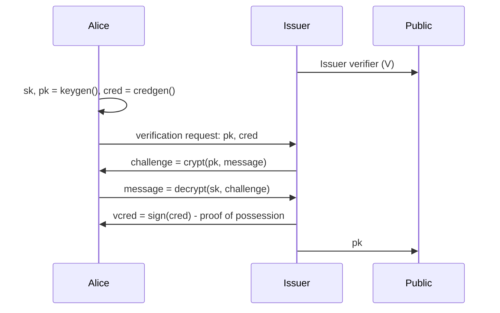
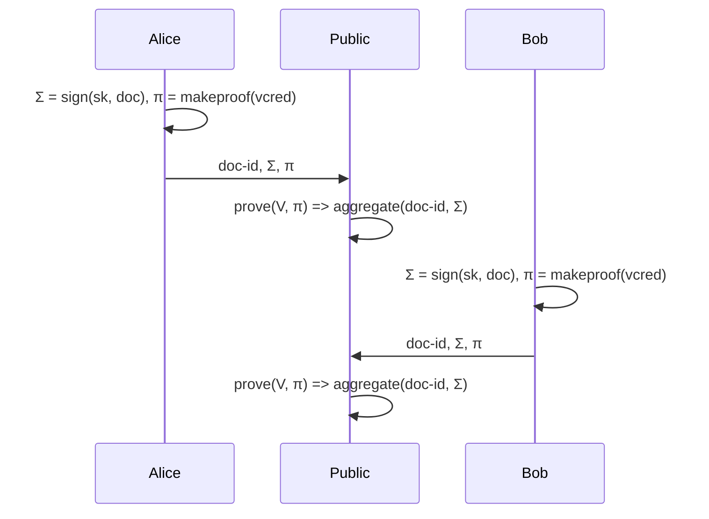
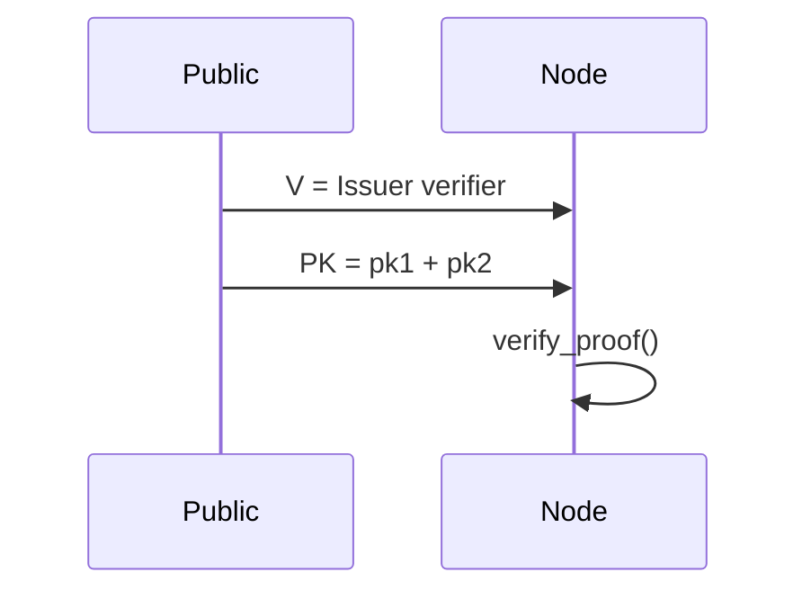

# BLS Multi-sig with zero-knowleddge proof-of-possession

This crypto scheme consists into a signature process in multi-party computation where each party does not need to disclose its secret signing key to anyone else.

The BLS scheme is used as accumulator for both signatures and public keys.

The ZL scheme is added to protect against rogue-signature attacks

References:

- Coconut https://arxiv.org/pdf/1802.07344.pdf
- BLS https://tools.ietf.org/html/draft-irtf-cfrg-bls-signature-02
- BLS https://crypto.stanford.edu/~dabo/pubs/papers/BLSmultisig.html

## Keygen and credential signature

Alice as a participant contacts the Issuer to verify its possession of a secret key.

Upon succesful verification, the Issuer will emit a credential for zero-knowledge proofs.

Any participant is supposed go through setup to obtain proof-of-possession, this is a necessary measure against rogue-signature attacks and is the only centralized process in this scheme.

## Multiple signature

Alice and Bob have both signing keys (`sk`) and signed credentials (`vcred`), now they want to sign together a document (`doc`) without disclosing any secret to each other and without intermediaries.

The Public space (a DLT) can prove the authenticity of signatures submitted by checking the proof against the Issuer verifier ( `V` ).

The cipher message produced here is composed by:
1. ZKproof ( `π` ) which is untreacable and it proves that the following signature is made by a legitimate owner of a signing key, anyone can verify this using the Issuer public verifier.
2. Aggregated signature ( `Σ` ) can be a single signature or the sum of multiple signatures to be verified using every public signing key involved.

## Verify signatures

Once signatures are published, anyone can verify their authenticity.

To verify signatures one needs to know:
1. Public issuer verifier ( `V` )
2. Public signing keys of Alice and Bob ( `pk1` and `pk2` )
3. The document being signed ( `doc` )

